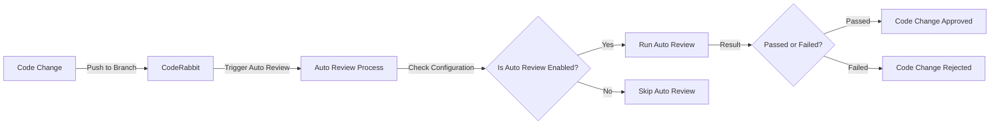

# Auto Review Configuration in CodeRabbit
Auto review configuration is a crucial aspect of maintaining code quality and ensuring that all changes meet the required standards. In this article, we will delve into the CodeRabbit configuration file, specifically the `.coderabbit.yaml` file, and explore how to set up auto review.

## Introduction to Auto Review
The auto review feature in CodeRabbit allows developers to automate the review process for their code changes. This is particularly useful in large projects where manual review can be time-consuming and prone to errors. The `.coderabbit.yaml` file is used to configure the auto review settings.

### Configuration File Explanation
The configuration file is written in YAML format and contains various settings for the auto review feature. Let's take a look at the provided code snippet:
```yml
reviews:
  auto_review:
    enabled: true
    base_branches:
      - "^(?!main).*"
```
In this snippet, the `auto_review` feature is enabled, and the `base_branches` setting is configured to exclude the `main` branch.

## Understanding the Configuration Options
The `base_branches` setting is a regular expression that matches the branch names to be excluded from auto review. In this case, the regular expression `^(?!main).*` matches any branch name that does not start with `main`. This means that any changes pushed to branches other than `main` will trigger an auto review.

### Junior Approach vs Senior Approach
A less experienced developer might write the configuration file without considering the implications of the regular expression. For example:
```yml
reviews:
  auto_review:
    enabled: true
    base_branches:
      - ".*"
```
This configuration would match all branch names, effectively disabling the auto review feature. A more senior approach would be to use a specific regular expression that targets the desired branch names, as shown in the original snippet.

## Common Pitfalls and Trade-Offs
One common pitfall when configuring auto review is to use a regular expression that is too broad or too narrow. This can lead to unwanted auto reviews or missed reviews. A trade-off to consider is the balance between code quality and development speed. While auto review can ensure high code quality, it can also slow down the development process if not configured correctly.

### Mermaid Flowchart: Auto Review Process

This flowchart illustrates the auto review process in CodeRabbit. The configuration file plays a crucial role in determining whether auto review is enabled and which branches are excluded.

## Conclusion
In conclusion, configuring auto review in CodeRabbit requires careful consideration of the regular expression used to match branch names. By using a specific regular expression, developers can ensure that auto review is triggered only for the desired branches. To see this pattern in action, visit [StudeQ](https://studeq.onrender.com/) and explore the codebase.