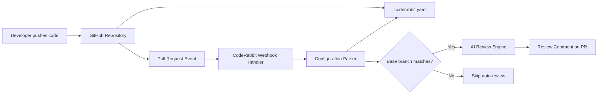
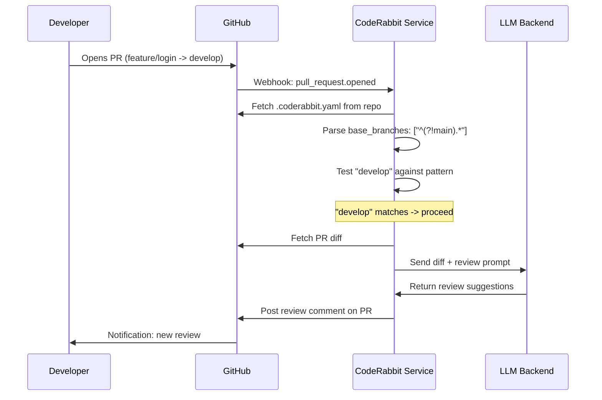

# CodeRabbit Configuration Guide for Branch-Based Review Automation

This guide explains how to configure CodeRabbit’s automated code review system to selectively trigger on specific branches while excluding others. You will learn the YAML configuration syntax, regex branch matching patterns, and practical strategies for integrating automated reviews into your CI/CD workflow.

## Table of Contents
1. [What the `.coderabbit.yaml` File Does](#what-the-coderabbityaml-file-does)
2. [Configuration Structure Breakdown](#configuration-structure-breakdown)
3. [The Regex Branch Exclusion Pattern](#the-regex-branch-exclusion-pattern)
4. [Junior vs Senior Approach to Branch Filtering](#junior-vs-senior-approach-to-branch-filtering)
5. [Common Pitfalls When Configuring Auto-Review](#common-pitfalls-when-configuring-auto-review)
6. [Architecture: How CodeRabbit Integrates with Your Git Workflow](#architecture-how-coderabbit-integrates-with-your-git-workflow)
7. [Request Flow: From Push to Review Comment](#request-flow-from-push-to-review-comment)
8. [Trade-Offs and When Not to Use Auto-Review](#trade-offs-and-when-not-to-use-auto-review)
9. [See This Pattern in Production](#see-this-pattern-in-production)

---

## What the `.coderabbit.yaml` File Does

The `.coderabbit.yaml` file is the central configuration point for CodeRabbit, an AI-powered code review tool that integrates with GitHub pull requests. When placed at the root of your repository, this file controls when and how automated reviews run. The configuration shown here enables auto-review globally but restricts it to branches whose names do not match `main` — a common pattern for protecting production branches from noisy bot comments while still reviewing feature and fix branches.

This single file determines whether every push triggers a review, which base branches qualify, and what level of scrutiny the bot applies. Without it, CodeRabbit falls back to default behavior that may review every branch indiscriminately.

---

## Configuration Structure Breakdown

The provided file uses a minimal but precise YAML structure:

```yaml
# File: .coderabbit.yaml
reviews:
  auto_review:
    enabled: true
    base_branches:
      - "^(?!main).*"
```

### Top-Level Key: `reviews`

The `reviews` key groups all settings related to pull request and commit review behavior. CodeRabbit uses this namespace to separate review configuration from other features like chat, summarization, or issue management.

### `auto_review` Block

The `auto_review` block controls whether CodeRabbit automatically posts review comments when a pull request is opened or updated. Setting `enabled: true` means every qualifying PR gets an AI-generated review without manual invocation.

### `enabled: true`

This boolean acts as a master switch. When `false`, no automatic reviews occur regardless of branch rules. Senior teams often toggle this during maintenance windows or when onboarding the tool to avoid overwhelming developers with initial feedback.

### `base_branches` List

The `base_branches` field is a list of regex patterns matched against the **target branch** of a pull request — the branch you are merging *into*, not the source feature branch. A PR targeting a branch that matches any pattern in this list triggers auto-review.

In this configuration, the single pattern `"^(?!main).*"` means: trigger review for every base branch *except* `main`.

---

## The Regex Branch Exclusion Pattern

The pattern `^(?!main).*` uses a **negative lookahead** — an advanced regex technique that deserves careful explanation.

### Breaking Down `^(?!main).*`

| Component | Meaning |
|-----------|---------|
| `^` | Anchors to the start of the string |
| `(?!main)` | Negative lookahead: asserts that `main` does **not** appear at this position |
| `.*` | Matches any character sequence (zero or more) |

The engine first checks: does the branch name *not* start with `main`? If that assertion passes, it matches the entire remaining string. The result is a pattern that matches everything except `main`.

### Why This Works for Branch Filtering

When a developer opens a PR from `feature/add-auth` into `main`, CodeRabbit tests the base branch `main` against `^(?!main).*`. The negative lookahead fails because `main` is present at the start. No auto-review triggers.

When a PR targets `develop` or `release/v2.1`, the lookahead succeeds, `.*` consumes the rest, and auto-review runs.

### Junior vs Senior Approach to Branch Filtering

**Junior Approach: Listing Branches Explicitly**

A less experienced developer might enumerate every allowed branch:

```yaml
# Junior approach — fragile and high maintenance
reviews:
  auto_review:
    enabled: true
    base_branches:
      - "develop"
      - "staging"
      - "feature/.*"
      - "hotfix/.*"
      - "release/.*"
```

This approach has concrete problems:

- **Maintenance burden**: Every new permanent branch (e.g., `epic/summer-release`) requires a config update.
- **Silent failures**: Forgetting to add a branch means reviews silently stop working for that target, with no error to alert the team.
- **Regex duplication**: Patterns like `feature/.*` and `hotfix/.*` overlap in structure but must be listed separately.
- **Accidental inclusion**: A typo like `"main"` (without regex anchors) would match branch names *containing* the substring "main", such as `feature/main-page-redesign`.

**Senior Approach: Exclusion by Default**

The senior pattern `"^(?!main).*"` flips the logic:

```yaml
# Senior approach — exclude only what you must protect
reviews:
  auto_review:
    enabled: true
    base_branches:
      - "^(?!main).*"
```

Benefits:

- **Zero maintenance**: New branches automatically qualify without config changes.
- **Defense in depth**: Only `main` is protected; everything else gets reviewed. If a team member accidentally targets `master` instead of `main`, reviews still run.
- **Explicit intent**: The negative lookahead makes it immediately obvious that `main` is the single protected branch. A reader doesn't have to mentally union multiple patterns.
- **Easy extension**: To also exclude `production`, the pattern becomes `"^(?!main$|production$).*"` — a single line change.

---

## Common Pitfalls When Configuring Auto-Review

### Pitfall 1: Confusing Source Branch with Base Branch

CodeRabbit’s `base_branches` field matches the **target branch of the PR**, not the source branch. A developer who writes `base_branches: ["feature/.*"]` intending to review only feature branches will be disappointed — this matches PRs *targeting* branches named `feature/something`, not PRs *from* feature branches.

**Correct mental model**: `base_branches` answers "which integration targets deserve automated scrutiny?"

### Pitfall 2: Unanchored Regex Patterns

A pattern like `develop` without `^` and `$` anchors matches any branch name *containing* the substring. `feature/develop-api` would trigger auto-review even if the developer intended only the exact branch `develop`.

**Fix**: Always anchor patterns unless substring matching is explicitly desired.

### Pitfall 3: Over-Reviewing During Sensitive Periods

Leaving `enabled: true` during a production incident or release freeze can flood on-call engineers with bot comments on emergency hotfix PRs. Senior teams either temporarily set `enabled: false` or add the hotfix base branch to an exclusion pattern during freeze windows.

### Pitfall 4: Assuming Regex Flavor Compatibility

CodeRabbit uses RE2-compatible regex (the Google regex library also used by Go). Negative lookaheads like `(?!...)` are supported, but backreferences and some PCRE-specific features are not. Test patterns in a RE2 playground before committing.

---

## Architecture: How CodeRabbit Integrates with Your Git Workflow

The following diagram shows where `.coderabbit.yaml` sits in the broader system and how configuration flows from repository to review output.



**What this diagram shows**: The `.coderabbit.yaml` file is read at review time, not at push time. When a pull request event fires, CodeRabbit’s webhook handler fetches the configuration from the repository, parses the `base_branches` patterns, and tests the PR’s target branch. Only if a pattern matches does the AI engine generate and post a review comment. This means configuration changes take effect immediately on the next PR event — no deployment or restart required.

---

## Request Flow: From Push to Review Comment

The sequence diagram below details the exact order of operations when a developer opens a pull request.



**Key detail**: The configuration fetch happens *after* the webhook arrives, meaning CodeRabbit always uses the latest committed version of `.coderabbit.yaml` on the default branch. If you push a config change to `main`, it affects all subsequent PRs immediately.

---

## Trade-Offs and When Not to Use Auto-Review

**Trade-off: Signal vs Noise**

Auto-review catches style issues, potential bugs, and missing tests early — but it also generates false positives. On a team new to AI review, the initial volume of comments can feel overwhelming. Start with `enabled: true` on a single non-critical branch like `develop` and expand once the team calibrates to the bot’s feedback style.

**Trade-off: Security of Protected Branches**

Excluding `main` from auto-review protects production from bot comments, but it also means PRs targeting `main` receive no automated scrutiny. If your team relies on CodeRabbit as a safety net, consider enabling it for `main` as well and using GitHub branch protection rules to enforce human approval alongside bot review.

**When to disable entirely**:

- During migration of a large monorepo where every PR touches thousands of files (cost and latency spike)
- On repositories with heavily templated or generated code that produces predictable false positives
- When the team has not yet agreed on which review suggestions to accept or ignore, creating inconsistent codebase changes

---

## See This Pattern in Production

The configuration pattern described here — excluding a single protected branch while reviewing everything else — is running live at [StudeQ](https://studeq.onrender.com/), a production educational platform. The team uses CodeRabbit to review every PR targeting `develop`, `staging`, and feature branches while keeping `main` clean for release managers. Explore the platform to see how automated review fits into a real CI/CD pipeline handling student note uploads, vector search, and payment processing.