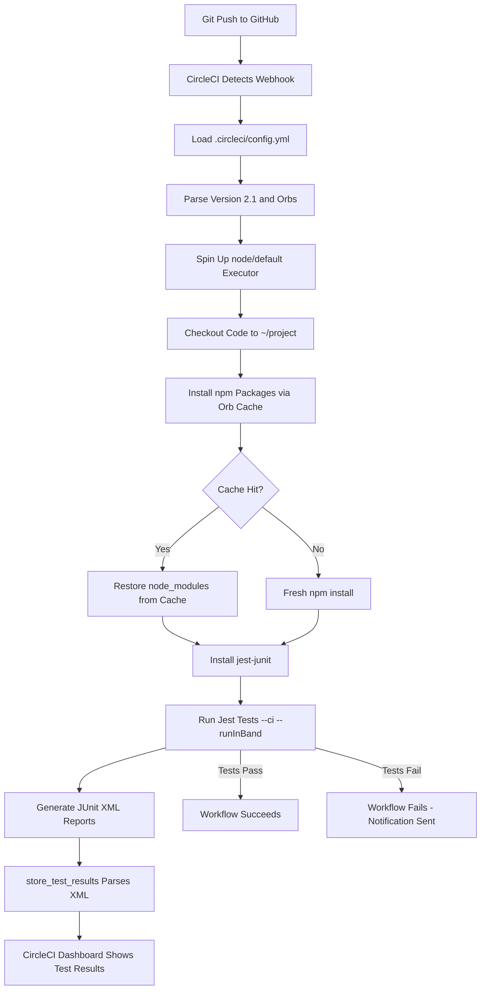
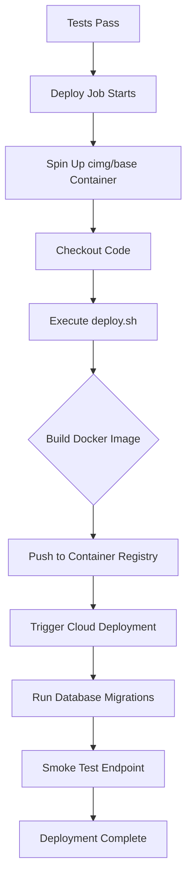

# CircleCI Configuration for Node.js Projects: A Complete CI/CD Pipeline Guide

**Meta Summary:** Learn how to set up a production-ready CircleCI pipeline for Node.js applications with automated testing, Jest junit reporting, and deployment workflows. This step-by-step guide covers the senior engineer's approach to continuous integration configuration, avoiding common pitfalls that junior developers make.

---

## Table of Contents
1. [Understanding the CircleCI Configuration Structure](#understanding-the-circleci-configuration-structure)
2. [Orbs: Reusable Configuration Packages](#orbs-reusable-configuration-packages)
3. [Defining Executors and Working Directories](#defining-executors-and-working-directories)
4. [Test Job: Installing Dependencies and Running Tests](#test-job-installing-dependencies-and-running-tests)
5. [Jest JUnit Integration for Test Reporting](#jest-junit-integration-for-test-reporting)
6. [Storing Test Results and Artifacts](#storing-test-results-and-artifacts)
7. [Deployment Job Configuration](#deployment-job-configuration)
8. [Workflow Orchestration](#workflow-orchestration)
9. [Junior vs Senior Approach: Common Mistakes](#junior-vs-senior-approach-common-mistakes)
10. [Complete Pipeline Visualization](#complete-pipeline-visualization)

---

## Understanding the CircleCI Configuration Structure

Every CircleCI pipeline starts with a `.circleci/config.yml` file at the root of your repository. This YAML file tells CircleCI what to do when code gets pushed. The configuration you're looking at comes from the StudeQ application—a full-stack educational platform that combines Node.js, Express, MongoDB, PostgreSQL, Pinecone vector search, and multiple LLM integrations.

The config file defines the entire automated workflow: installing dependencies, running tests, capturing test results, and optionally deploying to production. CircleCI reads this file on every git push and executes the defined jobs in the order specified by your workflows.

```yaml
version: 2.1
orbs:
  node: circleci/node@5
```

The `version: 2.1` declaration enables access to newer CircleCI features like orbs, reusable commands, and advanced workflow filtering. Version 2.0 is older and lacks orb support. Version 2.1 is backward compatible—every 2.1 config runs on 2.0 infrastructure, but with additional syntax capabilities.

---

## Orbs: Reusable Configuration Packages

Orbs are CircleCI's package manager for configuration. Instead of writing boilerplate installation scripts every time, you import a certified orb that bundles common tasks. The `circleci/node@5` orb provides pre-built commands for installing Node.js, managing npm/yarn packages, and caching dependencies.

This is what a junior developer might write without orbs:

```yaml
# Junior approach: manual Node.js installation
jobs:
  test:
    docker:
      - image: circleci/node:18
    steps:
      - checkout
      - run:
          name: Install Node.js
          command: |
            curl -sL https://deb.nodesource.com/setup_18.x | sudo -E bash -
            sudo apt-get install -y nodejs
      - run:
          name: Install dependencies
          command: npm install
```

The senior approach uses orbs because:

1. **Version pinning is automatic**—the orb maintainer handles Node.js version updates and security patches. You don't need to track when Node 18 reaches end-of-life.
2. **Caching is built in**—the orb's `install-packages` command automatically caches `node_modules` based on your lockfile hash. Manual installations often skip caching, doubling build times.
3. **Error handling is standardized**—orbs exit with proper error codes and logging. Custom shell scripts often swallow errors silently.

The tradeoff: orbs introduce a dependency on CircleCI's orb registry. If the registry is down or the orb version is yanked, your pipeline breaks. For critical production systems, some teams vendor orb source code into their repository as a fallback.

---

## Defining Executors and Working Directories

```yaml
jobs:
  test-node:
    executor: node/default
    working_directory: ~/project/server
```

The executor defines the runtime environment. `node/default` comes from the imported orb and provides a Docker container with Node.js pre-installed, along with common build tools. You're not specifying a Docker image manually because the orb handles that—it selects a Node LTS image with npm and yarn available.

The `working_directory` is set to `~/project/server` because the StudeQ project is a monorepo where the server code lives in a subdirectory. The `~` tilde expands to `/home/circleci` inside the container. This path matters because:
- Checkout commands place code relative to this directory
- Caching keys often include the working directory path
- Relative paths in npm scripts resolve from here

A common junior mistake is omitting `working_directory` in monorepos, which causes commands to run in the wrong folder. You'll see `npm install` succeed but `npm test` fail because it can't find the test files in the root directory.

---

## Test Job: Installing Dependencies and Running Tests

```yaml
steps:
  - checkout:
      path: ~/project
  - node/install-packages:
      pkg-manager: npm
  - run:
      command: npm install jest-junit
  - run:
      name: Run tests
      command: npm run test --ci --runInBand --reporters=default --reporters=jest-junit
```

Let's break down each step:

**Checkout with explicit path:** The `path: ~/project` parameter clones the repository into the home directory, not just the working directory. This gives you access to the full monorepo structure. The server code at `~/project/server` becomes your working context, but you can reference sibling directories like `~/project/client` if needed.

**Package installation via orb:** `node/install-packages` with `pkg-manager: npm` does more than just `npm install`. It:
1. Detects your lockfile (`package-lock.json`)
2. Computes a cache key from the lockfile's checksum
3. Restores cached `node_modules` if the checksum matches
4. Falls back to fresh installation if the cache misses
5. Saves the new `node_modules` to cache for future builds

**Explicit jest-junit installation:** Jest-junit is a reporter that outputs test results in JUnit XML format. CircleCI's `store_test_results` step consumes this XML. Installing it separately rather than including it in `devDependencies` keeps your production dependencies lean. The tradeoff: if the npm registry is slow, this extra install step adds 5-10 seconds to every build.

**Test execution flags:**
- `--ci` prevents Jest from running in watch mode (which would hang the CI server)
- `--runInBand` forces tests to run sequentially in a single thread. In CI environments with limited CPU, parallel test workers can cause flaky timeouts. Running in band is slower but deterministic.
- `--reporters=default --reporters=jest-junit` runs both the console reporter (so you see test output in CircleCI logs) and the JUnit reporter (for structured test result storage)

---

## Jest JUnit Integration for Test Reporting

The environment variable `JEST_JUNIT_OUTPUT_DIR: ./test-results/` tells jest-junit where to write XML files. CircleCI's `store_test_results` step looks for JUnit XML in a configurable path and surfaces test failures in the dashboard.

```yaml
environment:
  JEST_JUNIT_OUTPUT_DIR: ./test-results/
```

Without this variable, jest-junit writes to the current directory, mixing XML files with source code. The senior approach isolates test artifacts in a dedicated directory for three reasons:

1. **Clean separation of concerns**—source code and build artifacts shouldn't intermingle
2. **Predictable path for store_test_results**—you always know where to find the XML
3. **Easy gitignoring**—add `test-results/` to `.gitignore` once and forget about it

Here's the junior approach you'll often see:

```javascript
// Junior: manually generating JUnit reports in package.json
{
  "scripts": {
    "test:ci": "jest --ci --json --outputFile=test-results.json"
  }
}
```

The JSON output format isn't compatible with `store_test_results`. CircleCI expects JUnit XML specifically. The senior approach uses jest-junit because it produces the exact schema CircleCI ingests, giving you per-test failure details, execution time tracking, and historical trend data in the CircleCI dashboard.

---

## Storing Test Results and Artifacts

```yaml
- store_test_results:
    path: ./test-results/
```

This single line unlocks CircleCI's test analytics. After execution, CircleCI parses every XML file in `./test-results/`, extracts test names, suites, durations, and failure messages, and displays them in the web UI under the "Tests" tab. Over time, you can see which tests are slow, which ones fail most frequently, and whether your test suite execution time is trending upward.

The path `./test-results/` is relative to `working_directory`, which resolves to `~/project/server/test-results/`. If you set `working_directory` incorrectly, `store_test_results` looks in the wrong place and silently finds nothing—your build passes but no test data appears in the dashboard. This is a common debugging headache.

A more advanced configuration might also store artifacts:

```yaml
- store_artifacts:
    path: ./test-results/
    destination: test-reports
```

`store_artifacts` makes the XML files downloadable from the CircleCI build page, while `store_test_results` parses them for analytics. They serve different purposes—use both when you need downloadable reports alongside dashboard insights.

---

## Deployment Job Configuration

```yaml
deploy:
  docker:
    - image: cimg/base:stable
  steps:
    - run:
        name: deploy
        command: '#e.g. ./deploy.sh'
```

This is a placeholder deployment job—it's commented out in the workflow and the command is a no-op comment. The image `cimg/base:stable` is CircleCI's minimal Ubuntu image without Node.js, Python, or other language runtimes. It's designed for deployment scripts that might use SSH, rsync, kubectl, or cloud CLI tools.

A real deployment job for StudeQ would likely:
1. Build the Docker image from the repository
2. Push to a container registry (Docker Hub, AWS ECR, or Google Artifact Registry)
3. SSH into a production server or trigger a cloud deployment (Render, Railway, AWS ECS)
4. Run database migrations
5. Smoke test the production endpoint

The senior engineer leaves a commented placeholder rather than a half-implemented script. Why? An incomplete deployment script that's uncommented might accidentally execute, overwriting production data or breaking the live site. The comment forces a conscious decision to implement deployment before it can run.

```yaml
# Junior approach: overconfident placeholder that could accidentally run
deploy:
  steps:
    - run:
        name: deploy
        command: ./deploy.sh  # deploy.sh doesn't exist, build fails
```

The senior version fails gracefully because the command is literally a bash comment—it exits with code 0 and prints nothing. The junior version fails with a "file not found" error, confusing the team and blocking the pipeline.

---

## Workflow Orchestration

```yaml
workflows:
  build-and-test:
    jobs:
      - test-node
      # - deploy:
      #     requires:
      #       - test-node
```

The workflow named `build-and-test` currently runs only `test-node`. The `deploy` job is commented out, meaning the team hasn't yet connected their CI pipeline to production deployment. The `requires: - test-node` syntax would ensure deployment only triggers after tests pass—a fundamental safety gate.

CircleCI workflows support fan-out parallelism. If the StudeQ monorepo had separate client and server test suites, the workflow could run both simultaneously:

```yaml
workflows:
  build-and-test:
    jobs:
      - test-server
      - test-client
      - deploy:
          requires:
            - test-server
            - test-client
```

The deploy job waits for both test suites to pass. If either fails, deployment is blocked. This pattern prevents partial failures from reaching production.

---

## Junior vs Senior Approach: Common Mistakes

**Mistake 1: Not pinning orb versions**

```yaml
# Junior: unpinned version
orbs:
  node: circleci/node
```

Unpinned orbs float to the latest version. A minor orb update could change Node.js version defaults, break caching behavior, or deprecate commands your pipeline uses. Always pin the major version (e.g., `@5`) to get bug fixes and security patches without breaking changes. For maximum stability, pin to a specific patch version like `@5.0.2`.

**Mistake 2: Ignoring cache efficiency**

```yaml
# Junior: no caching, reinstalls everything every build
steps:
  - checkout
  - run: npm install
```

Without caching, every build downloads the entire internet of npm packages. For a typical Express app with 200 dependencies, this wastes 30-60 seconds per build. The orb's `install-packages` caches based on lockfile hash, so installs only happen when dependencies actually change.

**Mistake 3: Running tests with default parallelism**

```yaml
# Junior: running tests in parallel on a 2-CPU CI container
command: npm test --ci
```

Jest defaults to `(CPU count - 1)` workers. On CircleCI's default medium container with 2 CPUs, Jest spawns 1 worker—fine. But on larger containers with 4+ CPUs, parallelism increases and tests that share database connections or file system resources start failing with race conditions. `--runInBand` is the safe default for CI.

**Mistake 4: Not setting working_directory in monorepos**

```yaml
# Junior: assumes code is at repository root
jobs:
  test:
    steps:
      - checkout
      - run: cd server && npm test
```

The `cd server` pattern works but pollutes every command with a directory change. If someone adds a step that forgets to `cd server`, it runs in the wrong context. Setting `working_directory` once guarantees all commands execute in the right place.

---

## Complete Pipeline Visualization

Here's the flow of the current CI pipeline when a developer pushes code to the StudeQ repository:



If the deployment job were uncommented, the pipeline would extend:



---

## Next Steps and Real-World Application

The CircleCI configuration you've analyzed powers the continuous integration pipeline for [StudeQ](https://studeq.onrender.com/)—a production educational platform that combines Node.js APIs, vector search, LLM integrations, and payment processing. You can see this exact pipeline pattern running live, where every code push triggers automated testing before reaching students and educators.

For teams adopting this pattern, start by copying the test job structure, then gradually uncomment and implement the deployment job as your production infrastructure matures. The placeholder approach lets you ship CI testing today without blocking on deployment automation tomorrow.

**Explore the live implementation at [https://studeq.onrender.com/](https://studeq.onrender.com/)** to see how a well-tested codebase behaves in production.